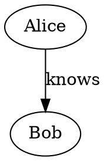

# pivotick-transformer-dot

Exports Pivotick's `nodes` / `edges` shape — this repo's [`ConversionResult`](../core/src/types.ts), the same thing every converter in this monorepo already produces — to the [Graphviz DOT language](https://graphviz.org/doc/info/lang.html).

This is the opposite direction from every other package here: `pivotick-transformer-<format>` packages turn a third-party format *into* Pivotick's shape; this one turns Pivotick's shape *into* a third-party format (DOT). It doesn't extend `GraphConverter` or register with `ConverterRegistry` for that reason — those exist so every "into Pivotick" converter looks the same from the outside, which doesn't apply to a converter going the other way.

## Usage

```ts
import { toDot } from 'pivotick-transformer-dot'

const dot = toDot({
  nodes: [{ id: 'a', data: { label: 'Alice' } }, { id: 'b', data: { label: 'Bob' } }],
  edges: [{ from: 'a', to: 'b', data: { label: 'knows' } }],
})
```



## Options

All optional, passed as a second argument:

| option | default | effect |
|---|---|---|
| `directed` | `true` | `digraph`/`->` vs `graph`/`--` — matches Pivotick's own `isDirected` default |
| `graphName` | `'G'` | the graph's own DOT identifier (cosmetic only) |
| `nodeLabel(node)` | `node.data.label` if a string | derives a node's `label` attribute |
| `nodeAttributes(node)` | — | extra DOT attributes for a node, e.g. `{ shape: 'box' }` |
| `edgeLabel(edge)` | `edge.data.label` if a string | derives an edge's `label` attribute |
| `edgeAttributes(edge)` | — | extra DOT attributes for an edge |
| `includeChildEdges` | `true` | see below |

## Scope and limits

- **IDs and strings are always safely quoted/escaped** per the DOT grammar — arbitrary ids (UUIDs, ids containing quotes or newlines, ...) are always valid output. A bare, unquoted id is only used when it's unambiguously safe (a simple alphanumeric/underscore token, or a numeral) and reads more naturally, e.g. `a -> b` rather than `"a" -> "b"`.
- **`RawNode.children`** (Pivotick's own expand/collapse nesting) has no DOT equivalent, so it's flattened: every child becomes an ordinary top-level node, plus a synthetic `style="dashed"` edge from parent to child recording the relationship that existed. Set `includeChildEdges: false` to flatten silently, with no synthetic edge, if that relationship doesn't matter for your use of the output.
- **`RawNode.style` / `RawEdge.style`** (Pivotick-specific rendering hints — shape, color, icon, ...) are not automatically translated to Graphviz attributes; their key names and semantics don't line up with DOT's attribute set closely enough to map blindly. Use `nodeAttributes`/`edgeAttributes` to opt specific attributes in explicitly.
